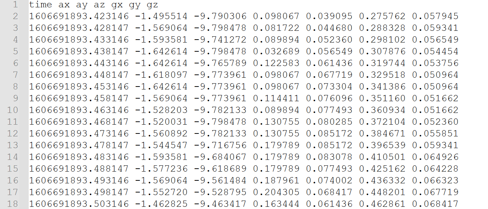
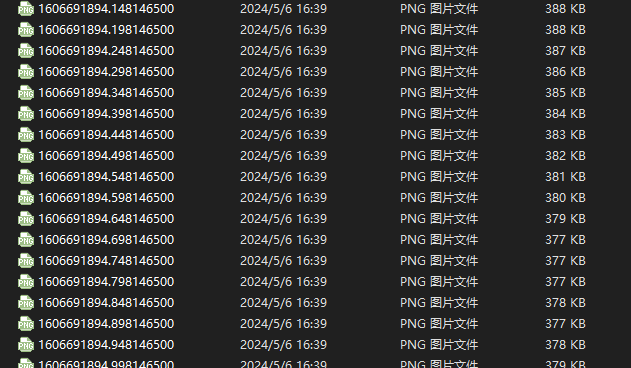

# ROS2 convert between imu/img and bag 

Here are three package: 

* subscribe to a ROS2 image topic and stores received messages to PNG files or 
extract images from a ROS2 BAG with the package *ros2_bag_to_image*. 

* extract imu data from a ROS2 BAG with package *ros2_bag_imu* 

* write imu data or/and images to ROS2 BAG with package *data_to_bag*

Whether it's extracting pictures/imu or writing pictures/imu. Their format is as follows:

**IMU** :


**IMAGE** :



## Prerequisites
- ROS2 
- Opencv 

## build 
```bash
mkdir -p WS_space/src
cd WS_space
git clone http://github.com/freesix/covert_ros2.git
source /opt/ros/humble/setup.bash
colcon build
```

## run

### Topic to Image

Subscribes to a ROS2 Image topic and stores received messages to PNG files.

How to launch:
```
ros2 launch ros2_bag_to_image topic_to_image.launch.py \
    input/topic:=/camera/image_rect compressed:=True
```

The images are exported in lossless PNG format.

Set `compressed` to `True` to subscribe to a compressed image_transport.

### Parameters
| Parameter       | Default      | Description                        |
|-----------------|--------------|------------------------------------|
| `input/topic`   | `/image_raw` | ROS2 Topic to subscribe            |
| `output/path`   | `/tmp/`      | Path where to store the PNG files. |
| `output/prefix` |              | Text to prepend to the output file |

### BAG To Image

Opens, reads, extracts and saves `sensor_msgs/msg/Image` or `sensor_msgs/msg/CompressedImages` from ROS2 bag.

Stores all the topics in the defined output path, names the images as:
`stampsecs_stampnsecs.png`


How to launch:
```bash
$ ros2 launch ros2_bag_to_image bag_to_image.launch.py \
        input/path:=/PATH_TO/input_bag/ \
        input/topics:="['camera1/image_rawcompressed', 'camera2/image_raw']"
```

### Parameters
| Parameter              | Default   | Description                                                         |
|------------------------|-----------|---------------------------------------------------------------------|
| `input/path`           |           | Input Rosbag Path                                                   |
| `input/bag_format`     | `cdr`     | Path where to store the PNG files.                                  |
| `input/bag_storage_id` | `sqlite3` | Text to prepend to the output file                                  |
| `input/topics`         |           | List of Input Topics in the form `"['topic1', 'topic2', 'topicN']"` |
| `output/path`          | `/tmp/`   | Output path PNG files                                               |


### BAG To Imu

Extract imu from ROS2 bag, imu topic likes `sensor_msgs::msg::Imu`. The storage 
format is [imu](#**IMU**)

How to launch:
```
ros2 launch ros2_bag_to_imu topic_to_imu.launch.py \
    input/path:=/imu output/path:=/out input/topics"['topic1']"
```


### Parameters
| Parameter              | Default   | Description                                                         |
|------------------------|-----------|---------------------------------------------------------------------|
| `input/path`           |           | Input Rosbag Path                                                   |
| `input/bag_format`     | `cdr`     | Path where to store the PNG files.                                  |
| `input/bag_storage_id` | `sqlite3` | Text to prepend to the output file                                  |
| `input/topics`         |           | List of Input Topics in the form `"['topic1']"` |
| `output/path`          | `/tmp/`   | Output path of imu.csv                                              |


### Imu or/and Image To BAG
Imu raw data or/and Image raw write a ROS2 bag, you can just write imu or image, or 
both.

**note:** your imu data is named `imu.csv`. image path is `/Yourpath/topic1/`, because maybe you have multiple topics.

How to launch:
```bash
ros2 launch data_to_bag data_to_bag.launch.py  \
    input/path:=/imu output/path:=/out input/imu_topic:="/imu0/"  \ 
    input/img_topics:="['topic1', ..., 'topicN']"
```

if you just want to write imu

How to launch:
```bash
ros2 launch data_to_bag imu_to_bag.launch.py  \
    input/path:=/imu output/path:=/out input/imu_topic:="/imu0/" 
```

if you just want to write image

How to launch:
```bash
ros2 launch data_to_bag img_to_bag.launch.py \ 
    input/path:=/img output/path:=/out input/img_topics:="['topic1', 'topic2']"
```


